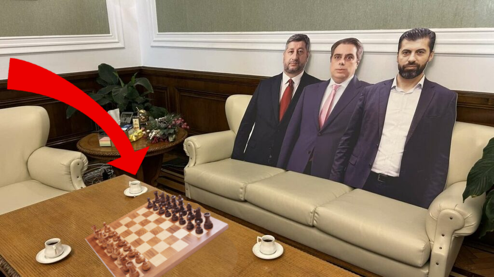

# Конзолен Шах



## Основни характеристики

- **Bitboard архитектура**  
    Всички позиции и ходове на фигурите се държат като `long` стойности в bitboard формат за максимална ефективност.
- **ANSI терминален интерфейс**  
    Използваме цветни фигури и полета чрез 24-bit ANSI кодове за максимален визуален комфорт в терминала.
- **История на ходовете**  
    Поддържа undo, запис на уловени фигури и всички стандартни шах правила.
- **Поддръжка на SAN и координатна нотация**  
    Въвеждане на ходове като `e2 e4` или `Nf3`.
- **Поддръжка на таймери**  
    Реализирани са 5 различни стратегии за мерене на време.

---

> [!CAUTION]  
> Изисквания
> 
> - Java 17 или по-нова  
> - 24-bit ANSI терминален емулатор (например Alacritty, Windows Terminal, iTerm2)
> - Make (за компилиране и стартиране)     
> - Docker (за билд и пускане чрез контейнер)

## Пускане на играта

### Клониране на репозитория

```bash
git clone https://github.com/OOP-11A-2025-2026/LukOilNeftohim-Chess.com.git
cd LukOilNeftohim-Chess.com
```

### Стартиране чрез Maven

Ако предпочитате Maven за билдване и пускане:

```bash
mvn clean compile
mvn exec:java
```

### Стартиране чрез Docker

```bash
cd build/docker
alias dcr='docker compose run --rm'
dcr neftomate
```

---

## Интерфейс

- Дъската се визуализира с цветни полета и фигури директно в терминала.
- Ходовете се въвеждат чрез стандартна шах нотация.
- Undo функцията позволява връщане на последните ходове.
- Поддържа всички специални ходове: рокада, en passant и промоция на пешка.
- За повече информация ползвайте `help`.
